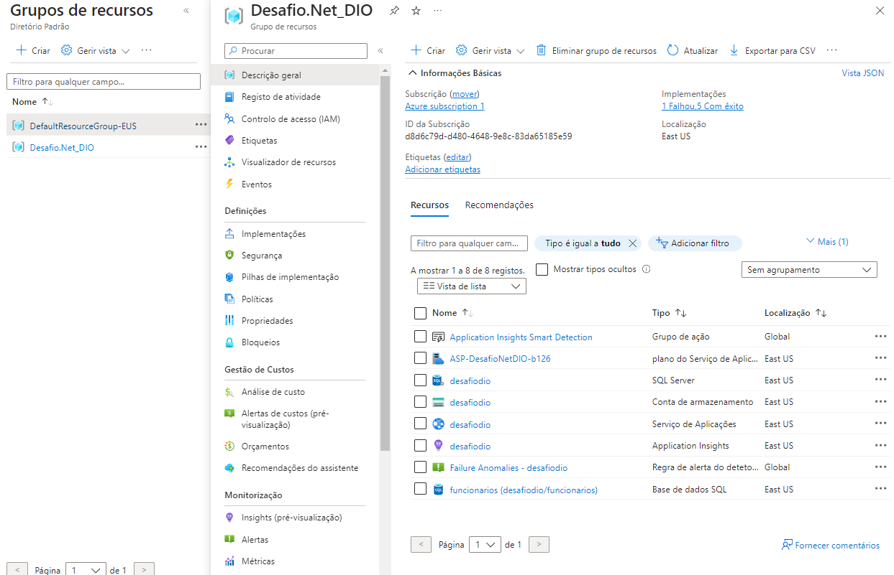

# Desafio Concluído com Sucesso!

## Projeto DIO - Trilha .NET - Nuvem com Microsoft Azure
[www.dio.me](www.dio.me)

### Desafio de Projeto
Concluí com sucesso o desafio proposto, aplicando seus conhecimentos adquiridos no módulo de Nuvem com Microsoft Azure da trilha .NET da DIO.

### Contexto
Construí um sistema de Recursos Humanos (RH) para a versão inicial do sistema, permitindo o cadastro de funcionários em uma empresa. O sistema possui operações CRUD (Criar, Ler, Atualizar e Deletar) e registra logs de todas as alterações nos funcionários.

### Premissas
A aplicação é uma Web API implantada no Microsoft Azure, utilizando o App Service para a API, SQL Database para o banco relacional e Azure Table para armazenar logs.

As logs de alterações nos funcionários são armazenadas na Azure Table.

A estrutura das classes principais, Funcionario e FuncionarioLog, segue o diagrama abaixo:


### Métodos Implementados
A implementação dos métodos segue o Swagger e os endpoints conforme especificado:

**Swagger**


**Endpoints**

| Verbo  | Endpoint                | Parâmetro | Body               |
|--------|-------------------------|-----------|--------------------|
| GET    | /Funcionario/{id}       | id        | N/A                |
| PUT    | /Funcionario/{id}       | id        | Schema Funcionario |
| DELETE | /Funcionario/{id}       | id        | N/A                |
| POST   | /Funcionario            | N/A       | Schema Funcionario |

Aqui está o schema (model) de Funcionario utilizado nos métodos:

```json
{
  "nome": "Nome funcionario",
  "endereco": "Rua 1234",
  "ramal": "1234",
  "emailProfissional": "email@email.com",
  "departamento": "TI",
  "salario": 1000,
  "dataAdmissao": "2022-06-23T02:58:36.345Z"
}
```

## Ambiente
O ambiente foi montado no Microsoft Azure, conforme o diagrama abaixo:





## Solução
O código fornecido estava pela metade, e eu dei continuidade obedecendo às regras descritas acima. Todas as implementações, incluindo a publicação na nuvem, foram realizadas com sucesso.

Me sinto grato por completar o desafio! 
